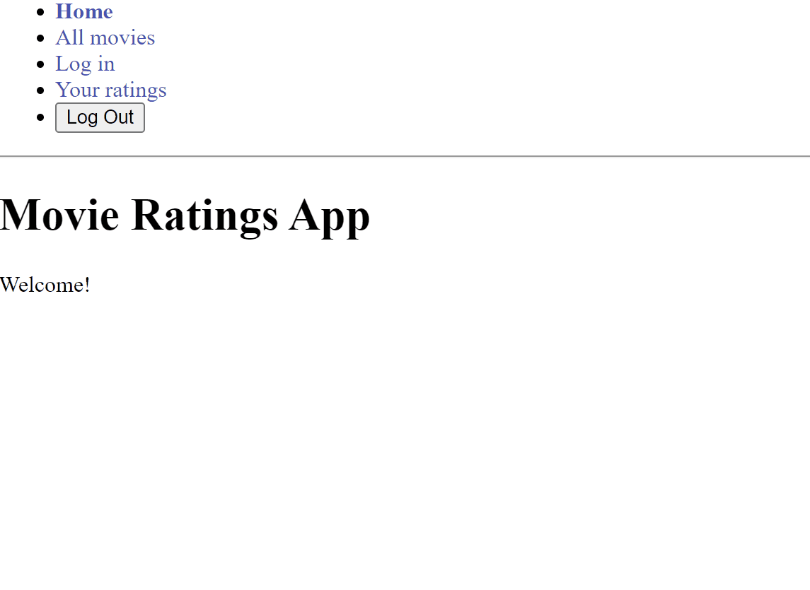

# Understanding Markdown

Markdown is a very fast, lightweight, and accessible plaintext document that can run on any OS and any operating system.



## Multi Level Headers

* Just like HTML, Markdown has multiple tiers of headers that describe the flow of the document

### Expand On Headers

> This Lets You Really Dig In And Break Down Your Project

## Description

This application allows you to rate and track your favorite movies! I built this to learn React Router, and Sequelize

## Tech Stack

| Tech | Description |
| -------- | -------- |
| Vite | For faster compile times than create-react-app |
| Express | To Power Back End |
| Sequelize | To interface with the Postgres Database |
| React-Router | Create Fast Navigation for the User |

### Handling Routes

This is how I use react router to create front end routes:

``` JS
const router = createBrowserRouter(
  createRoutesFromElements(
    <Route path="/" element={<App />} errorElement={<ErrorPage />}>
      {/* Homepage */}
      <Route index element={<IndexPage />} />

      {/* All Movies */}
      <Route
        path="movies"
        element={<AllMoviesPage />}
        loader={async () => {
          const res = await axios.get('/api/movies/all');
          return { movies: res.data };
        }}
      />
```

## Future Development

* [ ] Add vanilla CSS Styling 😉
* [ ] Add Movies to the DB

## Resources

[Dummy JSON](https://dummyjson.com/): For Creating Seed Data used in [Tech Stack](#tech-stack)
